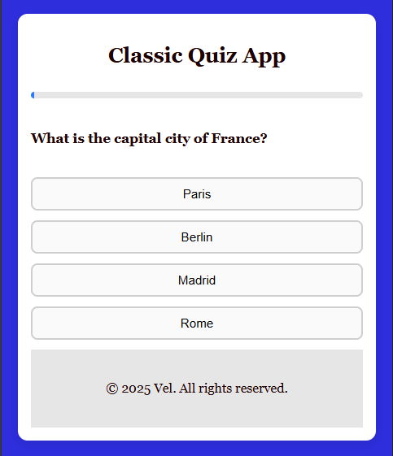

# 🎯 React Quiz App

A fully responsive, classic-style quiz application built with **React.js** and **pure CSS**. You can test your knowledge using either predefined questions or live trivia pulled from the [Open Trivia DB API](https://opentdb.com/).

---


## 🚀 Features

- ✅ Responsive design (mobile + desktop)
- ✅ Multiple choice questions
- ✅ 100+ predefined questions
- ✅ Live questions via Open Trivia DB
- ✅ Score tracking
- ✅ Smooth UI animations
- ✅ Classic aesthetic

---

## 🧠 Technologies Used

- React.js
- CSS (no libraries)
- Fetch API (for external trivia data)

---

## 📁 Project Structure

```bash
react-quiz-app/
├── public/
├── src/
│   ├── App.js
│   ├── App.css
│   ├── questions.js   
│   └── components/    
├── package.json
└── README.md
